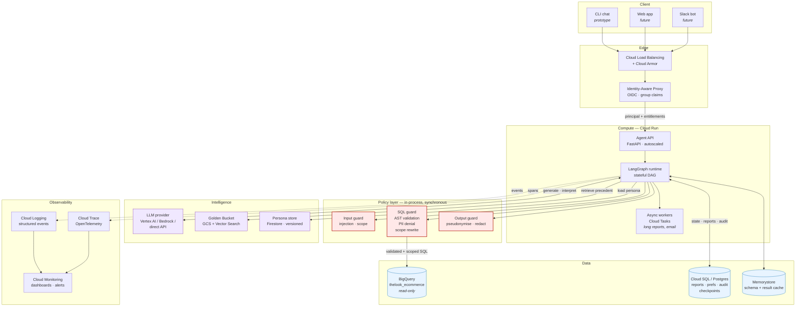
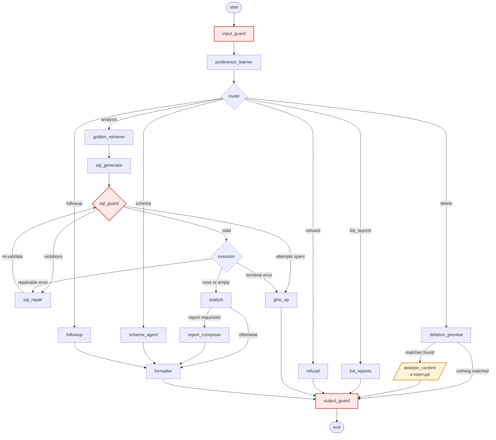
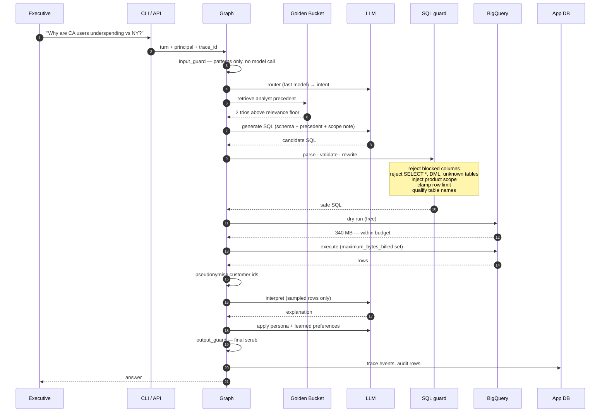
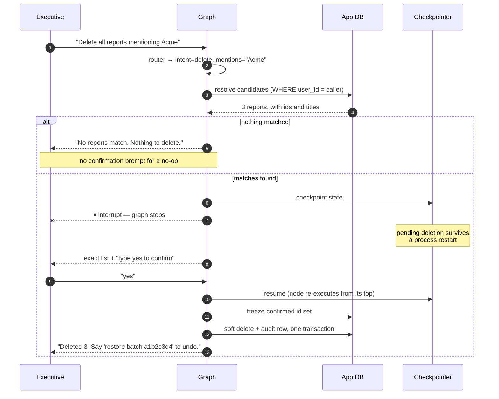
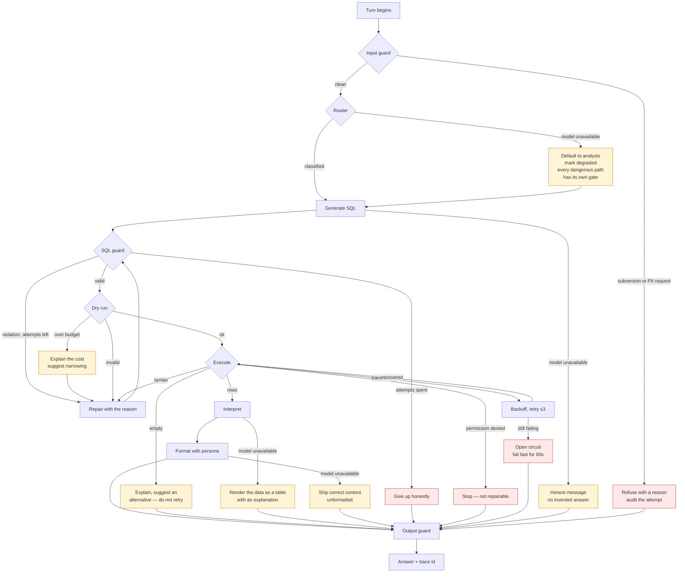

# Insight Agent — High-Level Design

A conversational data-analysis agent for retail executives. It answers
questions about sales, inventory and performance in natural language, runs the
SQL itself against BigQuery, explains what the numbers mean, and writes
reports with action items.

This document covers the production design. [README.md](README.md) covers
running the prototype.

---

## 1. What the system has to get right

Four things make this harder than putting a language model in front of a
database, and they shape every decision below.

**The model writes the query, so the query cannot be trusted.** A generated
query is untrusted input. It is checked by parsing it, not by asking the model
to behave.

**Two users asking the same question must get different answers.** Entitlement
is per-user and per-product, and it has to hold even when the question never
mentions a product.

**A wrong answer is worse than no answer.** An executive acting on a
hallucinated number causes more damage than one who was told the agent could
not answer. Every failure path ends in an honest message.

**The schema does not contain the business.** `order_items.status` is a
STRING; that this company counts `Complete` as revenue and excludes
`Returned` is knowledge held by analysts. That knowledge is retrieved, not
assumed.

---

## 2. Production architecture



The policy layer is drawn separately because it is the load-bearing part.
Everything else can be swapped; those three boxes are why the system is safe
to point at production data.

### Prototype mapping

The prototype implements the same structure with everything local, so it runs
on a reviewer's machine with no services to start.

| Production | Prototype | Why it is a fair substitute |
|---|---|---|
| Cloud Run + FastAPI | CLI process | Same graph, same nodes; only the transport differs |
| Identity-Aware Proxy | `security/identity.py` directory | Principals carry the same entitlement shape as OIDC claims |
| Cloud SQL (Postgres) | SQLite | Same schema and same access layer; driver swap |
| LangGraph + Postgres checkpointer | LangGraph + SQLite checkpointer | Identical interrupt/resume semantics |
| Vector Search over trio embeddings | BM25 over trio text | Same retrieval interface; see §6.1 |
| Firestore persona store | `personas/*.yaml`, reloaded per turn | Same "no deploy to change tone" property |
| Cloud Trace + Logging | JSONL + SQLite trace store | Same event stream, one emitter |
| Memorystore | In-process cache | Not needed at single-process scale |

---

## 3. The agent graph

This is the compiled graph, generated from the running code rather than drawn
by hand.



Three properties of this shape are deliberate.

**It branches.** A schema question never pays for SQL generation; a deletion
never touches the warehouse. In a linear chain every turn runs every step and
the irrelevant ones are told to do nothing — which costs latency and tokens on
every request.

**It has exactly one cycle, and it is bounded.** `sql_repair` routes back to
`sql_guard`, not to `executor`. A repaired query is re-validated, so a repair
that reintroduces a blocked column is caught by the same control that rejected
the first attempt. The bound lives in the routing function
(`route_after_guard`, `route_after_execute`), not inside a node, because an
early return inside a node could skip it.

**Every path converges on `output_guard`.** `END` is reachable from nowhere
else. A branch added later inherits the final scrub automatically rather than
depending on whoever adds it remembering to.

### When an agent is the wrong tool here

Not every turn needs one. `list_reports` and `deletion_preview` are
deterministic functions with no model call. The agent's judgement is used for
the three things that genuinely need it — deciding what the question means,
writing the query, and explaining the result. Everything else is a function,
because a function is cheaper, faster and testable.

---

## 4. Technology choices

### Orchestration: LangGraph

Chosen for one capability that the alternatives do not have natively:
`interrupt()` with a durable checkpointer.

Requirement 3 needs the agent to stop mid-execution, surface a confirmation,
survive a process restart, and resume exactly where it paused. In LangGraph
that is `interrupt()` plus a checkpointer — the state is already persisted, so
resumption is free. In a plain chain framework it means building a state
machine, a persistence layer and a resume protocol by hand, which is a
meaningful amount of code whose failure mode is a half-applied delete.

The second reason is the shape. LangGraph's `StateGraph` makes the branch
structure and the bounded cycle explicit and inspectable — the diagram in §3
is generated from the compiled graph, so it cannot drift from the code.

Third, per-node `RetryPolicy` with jittered exponential backoff and per-node
`error_handler` are framework-level, so resilience is declared where the risk
is rather than wrapped around everything uniformly.

*Alternatives considered.* **Google ADK** has a native BigQuery toolset and is
Gemini-first, which would have removed some integration code, but its
human-in-the-loop story is weaker and the assignment's hardest requirement is
human-in-the-loop. **Plain LangChain** would make this a linear chain, which
is precisely the structure the branching and cycle above exist to avoid.
**Agno** and **Strands** are credible but I have not run either in production,
and the assignment asks for an honest statement of experience.

*Experience.* I have built multi-node LangGraph systems with checkpointing and
conditional routing. The interrupt/resume path I researched and verified
against the installed version while building this, including the detail in §7
about node re-execution on resume, which is not obvious from the tutorials and
which silently breaks destructive operations if missed.

### Models: provider-pluggable, Gemini by default

Every node calls one `LLMClient`; only `llm/providers.py` knows which vendor
answers. Switching is an environment variable.

This is not over-engineering for its own sake. The free tiers that make this
prototype runnable have tight rate limits, so being able to move matters
practically. More importantly, a design that cannot change its model provider
has not really chosen one, and the assignment asks for the reasoning.

| Role | Purpose | Default (Gemini) | Why |
|---|---|---|---|
| `primary` | SQL synthesis, analysis, report writing | `gemini-3.7-flash` | The newest model a free API key can actually call. SQL generation is the quality-critical path |
| `fast` | Routing, classification, preference detection | `gemini-3.5-flash-lite` | These are short structured calls. Using the primary model for them triples cost for no gain |
| `chain` | Tried in order when `primary` is exhausted | 3.6-flash → 3.5-flash → 3.5-flash-lite → 3.1-flash-lite | A slightly weaker answer beats no answer |

`gemini-3.8-flash` is the strongest model and is *not* the default, because a
free API key gets `429 RESOURCE_EXHAUSTED` on the first call to it. Set
`INSIGHT_MODEL_PRIMARY_OVERRIDE` on a billed project to use it.

**Why a chain rather than one fallback.** Live testing against the free tier
produced the situation the chain exists for: `gemini-3.7-flash` returning 503,
`gemini-3.5-flash` quota-exhausted, and `gemini-3.5-flash-lite` healthy. A
single fallback would have given up while a working model was still
available. The chain stepped down and completed the turn with
`degraded=False`.

That test also exposed a design error worth recording: the circuit breaker
was keyed per *provider*. Exhausting the primary model's quota therefore
opened the circuit for the fallback model too — so the fallback path could
never fire in exactly the circumstance it was built for. Breakers are now per
model. A quota error also skips the retry budget entirely, because a daily
quota does not refill in eight seconds and only a different model can help.

Temperature is 0.0 for SQL and 0.4 for prose. SQL generation must not be
creative; two identical questions should produce the same query.

Anthropic, OpenAI, Groq and Ollama are configured with sensible defaults for
each role. Ollama is included specifically so the system can run with no data
leaving the machine, which is the constraint that matters in a retailer with
data-residency obligations.

### Warehouse: BigQuery

Given by the assignment, and the right choice anyway for this shape of work:
serverless, no cluster to size, and a dry-run API that prices a query before
running it. That last feature is what makes §7's cost control possible.

The agent talks to a `QueryExecutor` protocol, never to BigQuery directly.
That buys three things: the eval suite replays recorded fixtures so it is
deterministic and free; a second warehouse is a new implementation rather than
a change to the agent; and vendor exceptions are normalised into a taxonomy
the graph can reason about.

### Application state: Postgres in production, SQLite in the prototype

Reports, preferences, audit log, traces and LangGraph checkpoints share one
database. They are written together and read together — a saved report and its
audit row must commit atomically — so splitting them across stores would buy
nothing and cost a distributed transaction.

SQLite in the prototype is a deliberate choice, not a shortcut: it makes the
project runnable with no services to start, which the assignment requires. The
schema and the access layer are unchanged on Postgres.

---

## 5. Data flow

### A question that needs data



Two details in that sequence carry weight.

**The dry run happens before execution, every time.** It is free, it returns
the exact byte count the query would scan, and it validates syntax as a side
effect. Most bad SQL is therefore rejected before it can cost anything.

**Only sampled rows reach the model.** Forty rows, pseudonymised. A query
returning ten thousand rows does not put ten thousand rows into the context
window. This bounds cost and latency regardless of what the query returns, and
it bounds exposure: what the model never sees, it cannot repeat.

### A destructive request



---

## 6. How each requirement is met

### 6.1 Hybrid Intelligence — the Golden Bucket
*Designed; a working prototype is included.*

**The problem it solves.** The schema says `order_items.status` is a STRING.
It does not say that this company counts `Complete` and `Shipped` as realised
revenue and excludes `Cancelled`. A model given only the schema writes a
query that is valid and wrong. The trios carry that interpretation.

**Retrieval at query time.** The incoming question is scored against every
stored trio's question text and tags. The best matches above a relevance floor
are injected into the SQL prompt as few-shot examples, carrying the analyst's
query *and* their stated conclusion — so the model learns both the metric
choice and the reasoning pattern.

Returning nothing is a valid outcome and the floor exists to make it common.
A weak match actively harms the answer, because the model will follow it. In
the prototype, "Why did our churn rate spike last month?" retrieves the cohort
trio at score 11.5 and "What is the capital of France?" retrieves nothing.

**Why BM25 in the prototype, vectors in production.** At the scale of a
curated analyst library — hundreds to low thousands of trios — lexical
retrieval over question text plus tags performs well, needs no embedding
endpoint, and keeps the system provider-agnostic. In production the library
grows and paraphrase matters, so the production topology is:

```
GCS bucket (raw trios, versioned)
    → Cloud Function on object-finalise
        → validate schema, check the SQL still parses against the live schema
        → embed the question (Vertex AI text embeddings)
        → upsert into Vertex AI Vector Search
            → retrieved at query time, reranked by recency and usage
```

`golden/retriever.py` is the seam. Swapping to vectors means implementing
`score` differently; nothing above that module changes.

**How the bucket is updated.** Three sources, one gate.

1. *Analyst-authored.* The primary source. An analyst writes a trio and it is
   committed to the bucket.
2. *Promoted agent answers.* When a turn succeeds and the user reacts
   positively, `promote_candidate` writes the trio to a **review queue**, not
   to the live library. An analyst approves it by moving the file.
3. *Corrections.* When a user says the agent used the wrong metric, the
   corrected trio is queued with high priority.

The review gate is the important part. An agent that promotes its own
unreviewed output into its own few-shot examples reinforces whatever it got
wrong, and the drift is invisible because the examples look plausible. A human
approves every addition.

Maintenance the production version needs: deduplicate near-identical
questions so one popular query does not dominate retrieval; re-validate stored
SQL when the schema changes and quarantine trios that no longer parse; decay
trios that stop being retrieved.

### 6.2 Safety and PII masking
*Implemented in the prototype.*

Four layers. Each one alone is insufficient, and the reason each exists is
that the one before it can fail.

**Layer 1 — the schema the model sees.** Blocked columns are not in it. A
column the model has never seen is one it cannot be talked into selecting. The
access-policy note deliberately does not enumerate what is blocked, because
listing forbidden fields tells an attacker exactly what to ask for.

**Layer 2 — the input guard.** Pattern matching for prompt injection and
direct requests for personal data, before any model call. This is a cost
optimisation and a UX improvement, not a security control: it gives the user a
clear reason instead of a confusing "that column does not exist", and an
obvious attack costs nothing. It is not relied on, because a classifier can be
talked around.

**Layer 3 — the SQL guard.** The actual control. Generated SQL is parsed into
an AST with `sqlglot` and judged on structure:

| Check | Rejects |
|---|---|
| Statement type | Any `INSERT`/`UPDATE`/`DELETE`/`DROP`/`CREATE`/`ALTER`/`MERGE`/`TRUNCATE`/`GRANT` |
| Statement count | More than one — no chaining |
| Table allowlist | Anything outside the four catalogued tables, including `INFORMATION_SCHEMA` and cross-project references |
| Column **allowlist** | Anything not in the catalog, anywhere — projection, `WHERE`, `JOIN`, `ORDER BY`, `GROUP BY`, inside subqueries and CTEs. Blocked columns get a specific reason; unknown ones get another |
| Star expansion | `SELECT *` and `t.*`, because a star expands to whatever the table contains |
| Function denylist | `EXTERNAL_QUERY`, `SESSION_USER` and similar |

Checking `WHERE` as well as the projection matters:
`WHERE email = 'someone@example.com'` returns no personal column but reveals
whether a specific named person is a customer.

**Allowlist, not denylist.** This distinction is the difference between safe
by design and safe by luck. A denylist is correct only while the catalog is
exhaustive — the moment a `phone_number` column is added upstream, a denylist
silently permits it, and nothing tells you. An allowlist makes an
unclassified column unreachable until someone classifies it, so the window
between a schema change and its review is safe by default.

The query's own identifiers are exempt, because `SELECT SUM(sale_price) AS
revenue ... ORDER BY revenue` references a name no catalog could know. Result
aliases, CTE column lists and derived-table column lists are collected and
allowed; a blocked column is still rejected inside them, so an alias cannot
launder one out.

`insight verify-schema` reconciles the catalog against the live warehouse and
reports both directions: a catalogued column the warehouse lacks breaks
queries and fails the check; a live column nobody has classified is reported
but is not an error, because it is already unreachable.

**Layer 4 — the output scrubber.** Pseudonymises customer identifiers and
redacts identifier patterns from the final text. A redaction here means an
earlier layer failed, so it is counted as a metric and written to the audit
log rather than silently fixed.

**Pseudonymisation rather than removal.** "Top customers" is a required
capability, so customer identity must survive into the output while personal
identity must not. Each customer id becomes a stable `CUST-xxxxxxxx` token
derived by HMAC with a deployment-held key. The same customer is the same
token across turns and reports, so an executive can follow one customer
through a conversation. The token cannot be reversed without the key, and
rotating the key changes every pseudonym — which is the correct behaviour on
key compromise.

One detail worth flagging: the card-number pattern is Luhn-checked before it
redacts. In a tool whose output is full of large numbers, a naive 13-to-19
digit pattern would silently corrupt legitimate revenue figures. A false
positive here is worse than the failure the pattern prevents.

**Per-user product scope.** Each principal carries a set of departments or
categories. The scope is never given to the model as an instruction; it is
compiled into a predicate and applied by rewriting the query tree. The model
cannot omit a filter it was never responsible for writing.

The subtle part is *which* tables get rewritten. Filtering only `products`
leaves a hole: a Womenswear VP asks "what was total revenue", never mentions a
product, and gets the company-wide figure from `order_items` alone. So
`order_items` is rewritten too, constrained by product membership:

```sql
-- what the model wrote
SELECT SUM(sale_price) AS total FROM order_items

-- what actually runs, for a Womenswear principal
SELECT SUM(sale_price) AS total
FROM (
  SELECT __oi.* FROM `…thelook_ecommerce.order_items` AS __oi
  WHERE __oi.product_id IN (
    SELECT __p.id FROM `…thelook_ecommerce.products` AS __p
    WHERE __p.department IN ('Women')
  )
) AS order_items
LIMIT 1000
```

There is a test named after this case, because it is exactly the kind of gap
that passes a casual review.

*Documented assumption.* `orders` and `users` are not scoped. An order header
carries no product dimension and no monetary value, and customer demographics
are not product data. Scoping them would prevent a scoped user from counting
orders at all, which is not what "products related to him" means. If the
client intends order headers to be scoped, it is a one-line change to the
rewrite.

**Where this control belongs in production.** In the warehouse, not the
application. BigQuery authorized views or row-level access policies enforce
entitlement even if the application is compromised, and they apply to every
consumer of the data rather than only to this agent. The AST rewrite is the
prototype's approximation of that, and it is the right approximation because
it fails closed: an unclassified column is treated as blocked until someone
classifies it.

### 6.3 High-stakes oversight
*Implemented in the prototype.*

The tension is real. A modal "are you sure?" on every request is strict and
tiresome. A free-text "yes" interpreted by the model is pleasant and not
strict at all.

The resolution is to split the action across two nodes with a graph interrupt
between them.

`deletion_preview` resolves the phrase — "mentioning Client X", "from this
conversation" — into an explicit list of report ids, filtered by ownership.
Nothing is deleted. If it matches nothing, the turn ends there with a plain
statement; there is no confirmation prompt for an action that would do
nothing.

`deletion_confirm` begins with `interrupt()`. The graph stops, state is
checkpointed, and the exact list is shown. Only an explicit approval resumes
it.

Four details make this correct rather than merely polite.

**`interrupt()` re-executes its node from the top on resume.** Everything
before the `interrupt` call runs twice. This is not in the obvious
documentation path and it silently breaks destructive operations: a delete
written naively runs a second time on replay. Two defences — resolution lives
in the *previous* node so nothing with a side effect precedes the interrupt,
and `apply_deletion` is idempotent via a batch id that records `applied_at`.

**The confirmed set is frozen at preview time.** A report created between the
question and the approval is not swept up by it. There is a test for that.

**Consent parsing is a closed list, not a model call.** Interpreting consent
for a destructive action is not a job to delegate to a probabilistic
classifier. Anything not clearly affirmative is treated as "no" — "delete
everything please" and "maybe later" both cancel.

**Deletes are soft and reversible.** Rows are marked, every action writes an
audit row in the same transaction, and the response tells the user how to
undo it. Oversight you cannot inspect afterwards is not oversight.

Users delete only their own reports, and ownership is in the `WHERE` clause
rather than checked afterwards — so no code path reads or enumerates another
user's reports at all. That is what makes it safe to let them delete their own
without an approval step.

### 6.4 Continuous improvement
*User level implemented; system level designed.*

**User level.** Preferences are inferred from two signals. An explicit
statement — "always give me bullets" — is recorded at 0.95 confidence
immediately. A repeated implicit request raises confidence by 0.25 each time.
A preference is only applied above 0.6.

The threshold is the point. A preference applied too eagerly is worse than
none: one offhand "as bullets please" should not permanently change every
future report. Three implicit requests do; one does not. A contradicting
signal erodes confidence rather than flipping the belief instantly.

Preferences are a small closed key/value set, not a free-text memory blob, for
two reasons: a model cannot invent a key that silently changes behaviour no
one designed, and the user can run `/prefs` to see exactly what the agent
believes about them and correct it.

A cheap regex pre-filter decides whether to spend a model call on preference
detection at all. Most turns contain no preference signal, and a model call on
every turn to discover that is a standing tax on latency and cost.

**System level.** Three loops, in increasing order of how much human judgement
they need:

1. *Query patterns.* Successful question/SQL pairs are logged with their
   outcome. Recurring shapes become candidate golden trios via the review
   queue in §6.1.
2. *Failure mining.* Every `give_up` and every guard rejection is recorded
   with the question that caused it. Clustering these weekly shows where the
   agent is systematically weak — usually a missing semantic concept, which is
   fixed by adding a trio or a catalog description rather than by retraining.
3. *Prompt and catalog refinement.* When failure clusters point at a
   misunderstood column, the fix is a better `description` in
   `data/catalog.py`. This is the highest-leverage and least glamorous loop.

Deliberately not included: fine-tuning, and automatic promotion of the agent's
own output into its examples. The first is premature at this data volume; the
second is the drift failure described in §6.1.

### 6.5 Resilience and graceful error handling
*Implemented in the prototype.*

The system distinguishes three kinds of failure, because treating them alike
is how agents get stuck in loops or burn budget.

| Kind | Examples | Response |
|---|---|---|
| **Repairable** | Unknown column, syntax error, type mismatch, over byte budget | Show the model the error, regenerate, re-validate. Bounded to 2 attempts |
| **Retryable** | 429, 503, timeout, connection reset | Jittered exponential backoff, at most 3 attempts, then fall back to a smaller model |
| **Terminal** | Permission denied, circuit open | Stop immediately. Another attempt reaches the same wall more slowly |

Retrying a permission error wastes quota and latency for a guaranteed failure.
The taxonomy lives in `data/executor.py` and vendor exceptions are mapped into
it at the boundary.

**Empty results are not failures.** A query that runs correctly and returns no
rows has answered the question: nothing matched. It routes to interpretation,
which explains the likely reason and proposes a narrower question. Retrying
this is the classic wasteful loop, and there is a test asserting `sql_attempts
== 1` for the empty case.

**Cost control.** Four independent limits:

- Dry run before every execution; over budget is refused with a message the
  agent can act on.
- `maximum_bytes_billed` set on the job, so BigQuery kills anything the
  estimate missed.
- A row limit injected into every query, and clamped if the model asks for
  too many.
- Repair attempts bounded, so a confused model cannot generate queries
  indefinitely.

**Circuit breakers.** Retries help when a dependency is briefly unwell and
make things worse when it is properly down — every turn pays the full retry
budget before failing anyway, and the retries keep load on the failing
service. After four consecutive failures the circuit opens and calls fail
immediately. One trial call is allowed after the cooldown; success closes it,
failure re-opens it at once.

**Model fallback.** If the primary model is unavailable past its retry budget,
the call is reissued against a smaller one. A slightly weaker answer beats no
answer. The response records that it fell back, so degraded turns are visible
in metrics rather than silently worse.

**The interface never crashes.** Every turn runs inside an exception boundary
in the CLI. Anything reaching it produces a message, a trace id, and a session
that continues with its history intact. Degradation is layered: if the
formatter's model call fails, the correct content ships unformatted; if the
analyst's call fails but the data is in hand, the rows are rendered as a plain
table with an explanation. Presentation is the first thing to sacrifice.

### 6.6 Quality assurance
*Designed; a runnable harness is included.*

`evals/run_evals.py` has three suites because "is the agent good?" is three
questions with different failure modes.

**Security — a release blocker.** Twenty-five adversarial queries that must
be rejected and five scope cases that must be rewritten, plus a check that no
blocked column appears in the schema the model receives. One leak blocks the
release. This suite needs no model and no warehouse, runs in about 20ms, and
belongs on every commit in CI. A security regression is not traded off against
answer quality.

**Routing.** Fifteen questions with a known intent. Misrouting is cheap to
measure and expensive in production — a deletion classified as analysis is a
silent failure. Offline, it asserts the pattern guard does not fire on
legitimate questions, because false positives there would quietly make the
agent useless.

**Trajectory.** Given a question, does the generated SQL reference the right
tables, group by the right dimension, aggregate the right column, pass the
guard and parse? Scored structurally rather than by string match, because many
different queries correctly answer one question and exact-match scoring would
reject most of them. This is the suite that needs a live model.

**Verifying that reports answer user intent.** Structural scoring cannot tell
you whether an explanation is *right*. Three mechanisms, in production:

1. *Answer-grounding check.* Every number in the generated narrative must
   appear in the result set. This catches the most damaging failure mode —
   a plausible invented figure — mechanically, with no judge model.
2. *Analyst-reviewed regression set.* Thirty questions with analyst-written
   reference answers. A new prompt or model is scored against them by a human
   before rollout. Small, slow, and the only measure that actually tracks
   correctness.
3. *Shadow evaluation.* Run the candidate version alongside production on real
   traffic, compare SQL and conclusions, and review the disagreements. The
   disagreements are where the regressions are.

Deliberately not included: an LLM-as-judge score for prose quality. It is easy
to build, hard to trust, and produces a number that moves with model
temperature rather than with agent behaviour. It gives false confidence.

**Evaluating UX.** Behavioural signals, not surveys: turns-to-answer (how many
exchanges before the user got what they wanted), refinement rate (how often
the first answer needed rephrasing), abandonment (questions asked with no
follow-up), report-save rate as a proxy for usefulness, and confirmation
cancellation rate — a high rate means the agent is misreading deletion
requests and proposing the wrong thing.

### 6.7 Observability
*Implemented in the prototype.*

Requirement 7 has two halves that need different things. Knowing *that* the
agent is failing needs counters. Knowing *why* needs the full message
correspondence for one specific turn.

**Metrics, at the agent level.** Each maps to a question an on-call engineer
actually asks.

| Metric | Question it answers |
|---|---|
| `success_rate`, `turns_failed` | Is it working? |
| `avg_turn_ms`, `max_turn_ms` | Is it slow? |
| `sql_repairs_attempted` / `_recovered`, `repair_success_rate` | Is self-correction working, or just spending money? |
| `guard_rejections` | Is the model drifting toward unsafe queries? |
| `input_rejections` | Is someone probing the agent? |
| `output_redactions` | **Should always be zero.** Non-zero means an earlier layer failed |
| `bytes_billed`, `cost_usd` per turn | Is it economical? |
| `give_ups` | Where is it systematically weak? |
| Breaker state per dependency | Is something downstream down? |

`output_redactions` is the one to alert on immediately. It is the only metric
that indicates a control failure rather than a quality problem.

**Deep dive.** Every turn gets a `trace_id`, and every node emits ordered
events under it. `insight trace <id>` replays the whole turn: what the router
decided and why, which golden trios matched, the exact SQL generated, what the
guard rejected and on which rule, the bytes scanned, every repair attempt with
its error, and the final answer. That is the message correspondence the
requirement asks for.

Payloads are scrubbed before they are written. A trace store that accumulates
personal data is a second copy of the problem the guard exists to prevent —
an error message quoting a row would otherwise persist PII indefinitely.

Events go to two sinks from one emitter: a JSON-lines file, which is what a
log shipper tails into Cloud Logging, and SQLite for local replay. In
production the same emitter produces OpenTelemetry spans into Cloud Trace.
Only `obs/tracing.py` knows the difference.

**Alerting.** Page on: `output_redactions > 0`, success rate below 90% over 15
minutes, any circuit breaker open for more than 5 minutes, p95 turn latency
above 30 seconds, cost per turn above threshold. Review weekly rather than
page: `give_ups` clustered by topic, guard rejection reasons, repair success
rate by error type.

### 6.8 Agility — persona management
*Designed; a working prototype is included.*

The CEO changes the tone of reports weekly and must not need a deployment.

Personas are data, not code: a YAML file read at the start of every turn,
cached on modification time. Editing `personas/executive_brief.yaml` changes
the next answer. A persona sets tone, shape, length limit and style guidance.

Three defences, because a non-developer is editing this file:

- A malformed file never takes the agent down. The last good version stays in
  service, the parse error is logged and surfaced in the trace.
- An unknown persona name falls back to the default rather than erroring.
- Numeric fields are clamped. A typo of `50000` in `max_words` must not become
  a runaway generation bill.

**What a persona cannot do.** It cannot disable PII masking, widen data scope,
or change which tables are reachable — because none of those live in the
prompt. Persona content is inserted as *content*, and the controls are in the
AST guard and the identity layer. This matters: a configuration surface
exposed to non-developers is an attack surface, and the only safe design is
one where the worst case is an ugly report.

In production this moves to Firestore or GCS with versioning, a diff view, and
a lightweight approval step, fetched with a short TTL cache. The loader
interface does not change.

---

## 7. Error handling and fallback, end to end



The principle throughout: **degrade along the axis that matters least first.**
Presentation is sacrificed before content, content before correctness, and
correctness is never sacrificed — the agent says it could not answer instead.

There is no path that ends in a stack trace reaching the user, and no path
that ends in an invented number.

---

## 8. Extensibility

The assignment asks for new capabilities and new data sources to be easy. Both
are seams that already exist.

**A new capability — charts, email, web search.** Add a node and one
conditional edge from the router. Charts: an `intent="chart"` branch that
takes the result set and emits Vega-Lite, which the CLI renders as a file path
and a web client renders inline. Email: a node that queues a Cloud Task, kept
off the request path because a slow SMTP call should not hold a conversation
open. Web search for market trends: a node that runs alongside `golden` and
contributes context to the analyst prompt, with its own circuit breaker
because an external API is the least reliable dependency in the system.

Each is additive. None requires changing an existing node, because the router
is the only component that knows the set of intents.

**A new data source.** Implement `QueryExecutor` and add a catalog module. The
protocol is five methods. A Snowflake or Postgres source would reuse the guard
unchanged — `sqlglot` handles the dialect — and would need its own catalog
with its own PII classification. Cross-source questions would need a planner
node that decomposes into per-source queries and joins the results in the
agent, which is a real piece of work and is where I would draw the line for a
v1.

**A new user population.** Entitlement is a `Principal` with a scope
predicate. Adding "store managers see only their store" means a `store_id`
scope and one more rewrite rule, not a new access model.

---

## 9. What is prototyped and what is designed

The assignment asks for four requirements in working code and the rest as
design. Stated plainly, because a reviewer should not have to discover it.

| Requirement | Prototype | Notes |
|---|---|---|
| 1 Hybrid intelligence | **Working** (beyond scope) | BM25 over 8 analyst trios; production uses Vector Search |
| 2 Safety and PII masking | **Working** | 4 layers, column allowlist, 20-case adversarial suite, 5 scope-leak cases |
| 3 High-stakes oversight | **Working** | `interrupt()`, idempotent apply, soft delete, restore |
| 4 Continuous improvement | **User level working** | System-level loops designed in §6.4 |
| 5 Resilience | **Working** | Taxonomy, bounded repair, breaker, model fallback |
| 6 Quality assurance | **Harness working** | 46 offline cases; trajectory suite needs a model |
| 7 Observability | **Working** | Trace replay, metrics, audit log |
| 8 Persona agility | **Working** (beyond scope) | YAML hot reload; production uses Firestore |

---

## 10. Known limitations

Stated because a design document that lists no weaknesses has not been
thought about hard enough.

**Scope enforcement is in the application.** It should be in the warehouse.
BigQuery authorized views would make the entitlement hold even if this
application were compromised, and would apply to every consumer of the data.
The AST rewrite is a good approximation and fails closed, but it is an
approximation.

**BM25 misses paraphrase.** "Why is spend down in Texas" and "What is
depressing revenue in TX" share almost no tokens. Tags mitigate this; vectors
fix it. This is the first thing I would change at scale.

**Single-turn context.** The graph checkpoints conversation history, but the
SQL generator does not currently receive prior turns, so "now break that down
by month" starts fresh rather than modifying the previous query. The
`followup` branch handles discussion of a previous result without re-querying;
genuine query refinement needs the planner to see the prior SQL. That is a
contained change and is the highest-value next feature.

**The router is a single point of misclassification.** A deletion classified
as analysis fails safely — it runs a query instead of deleting — but a
genuine analysis question classified as `refused` is a bad experience. Routing
accuracy is measured in the eval suite for exactly this reason.

**No multi-source joins.** One warehouse per question. §8 sets out what
changes.

**The free tier constrains which models can be demonstrated.** The defaults
here are chosen for models a free key can call, not for the best available
model. On a billed project the primary should be `gemini-3.8-flash`.

**Cost estimates use published on-demand pricing.** An organisation with slot
reservations has a different cost model, and the displayed figure would be
wrong for them.

**The catalog is hand-written and can drift.** That is the price of carrying
business meaning and PII classification that `INFORMATION_SCHEMA` cannot.
`insight verify-schema` makes the drift visible rather than silent, and the
allowlist makes it safe rather than merely visible, but it is still a file
someone has to maintain.
